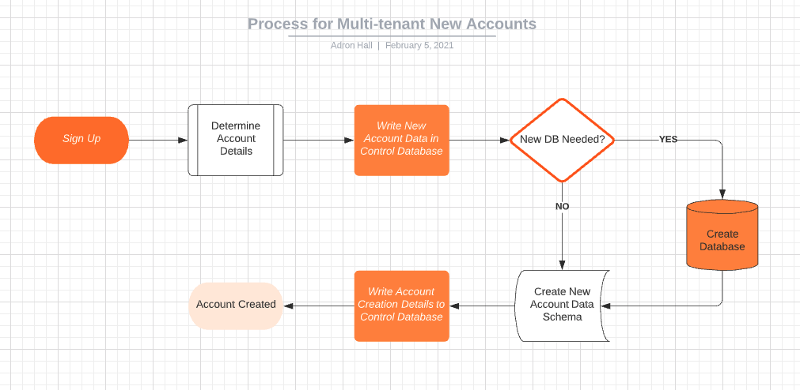

# Tenancy Example By Data

What's this?

This repository is an example of setting up multiple tenancy using a particular means, in this case, by data stored in a database. It is merely one example of what path one could use to setup tenancy within an application offering.

## Architecture

### Architecture - Root System

### Architecture - New Account Systems

## Development Setup

***Prerequisites***

### For Cloud Deploy

1. [Azure Account](https://azure.microsoft.com/en-us/) 
2. [Terraform](https://www.terraform.io/) 
3. [Azure CLI](https://docs.microsoft.com/en-us/cli/azure/install-azure-cli)
   > For installation of Terraform & Azure CLI, along with configuration check out my post [here](https://compositecode.blog/2019/08/01/development-workspace-with-terraform/).
4. [arbitures](https://github.com/Adron/arbitures) (Arbitrary Feature CLI), check it out, it's located [in this repo](https://github.com/Adron/arbitures).
5. [Hasura CLI](https://hasura.io/docs/1.0/graphql/core/hasura-cli/index.html) with [installation notes here](https://compositecode.blog/2020/10/13/hasure-cli-installation-notes/).

Set the following environment variables for root:

* systemicorganization = The name of the control organization.
* DBUN = Database Username
* DBPW = Database Password

### For Local Development

### Additional Parameters

Set these parameters/variables for every new account setup:

* server = The server database for the new account
* username = The account owner's username.
* password = The account owner's password.
* organization = The organization that owns the account. This will also be the default preface for names and other elements of the apps. 
* database = The specific database that the account will be assigned to.
* apps = The list of applications the user will have access to or is specifically signing up for. This will determine which set of tables need to be added to the database.

## Reference Material

* [Postgres Limits](https://www.postgresql.org/docs/current/limits.html)
* [SQL Server Limits](https://docs.microsoft.com/en-us/sql/sql-server/maximum-capacity-specifications-for-sql-server?redirectedfrom=MSDN&view=sql-server-ver15)
* [Azure Database for PostgreSQL Limits (Single Server)](https://docs.microsoft.com/en-us/azure/postgresql/concepts-limits)
* [Azure Database for PostgreSQL Limits (Flexible Server)](https://docs.microsoft.com/en-us/azure/postgresql/flexible-server/concepts-limits)
